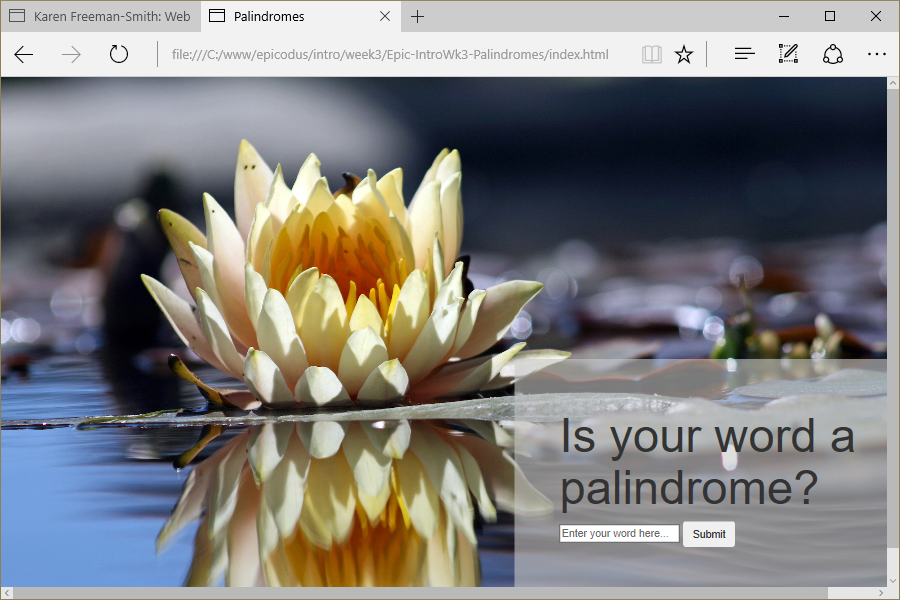

# Palindromes
Version 0.0.2: August 16, 2016
by [Karen Freeman-Smith](https://karenfreemansmith.github.io) and [Katy Henning](https://katycodes.github.io/portfolio)

### Technologies Used
HTML, CSS, Bootstrap, JavaScript, jQuery

## Description
*[Epicodus](http://epicodus.com) Intro to Programming Week 2 Pair Project with Katy Henning: Create a web page to identify whether or not a word is a palindrome.*

Version 0.0.2 - Improves user experience.

## Setup/Installation
* [View on Github Pages](https://karenfreemansmith.github.io/Epic-IntroWk3-Palindromes)
* _OR_
* Clone directory
* Open index.html in your favorite browser

## Support & Contact
For questions, concerns, or suggestions please email karenfreemansmith@gmail.com

## Specifications
* A palindrome is any word, phrase, number, or other sequence of characters which reads the same backward or forward.

## Known Issues
* None

## Legal
*Licensed under the GNU General Public License v3.0*

Copyright (c) 2016 Copyright _[Karen Freeman-Smith](https://karenfreemansmith.github.io) & [Katy Henning](https://katycodes.github.io/portfolio)_ All Rights Reserved.
